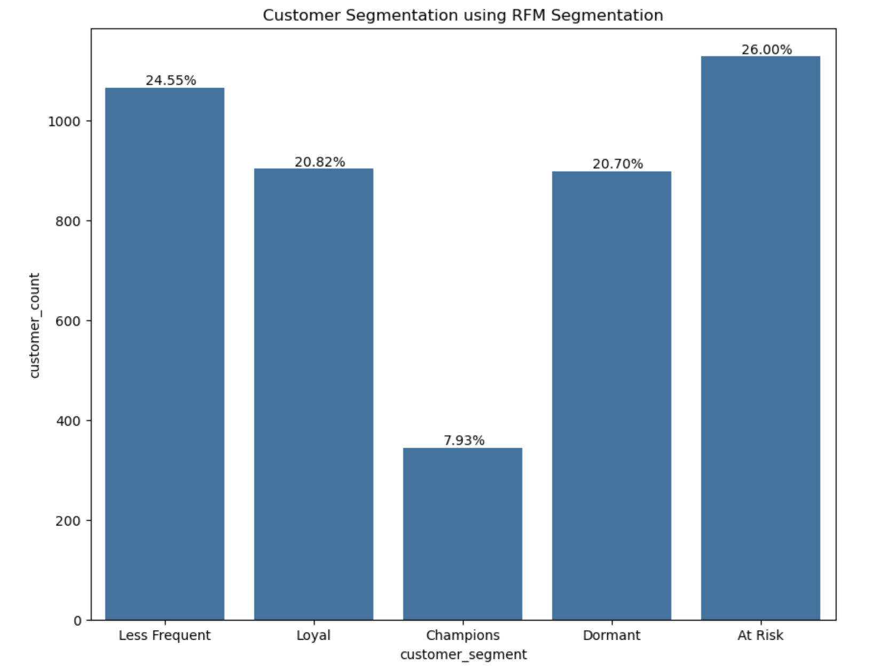
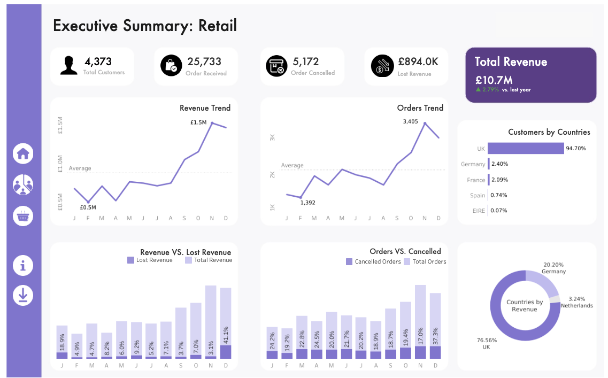

# 🛍️ eCommerce Retail Analytics - End-to-End Data Analysis Project

<div align="center">

**Transform Raw Transactional Data into Actionable Business Insights**


[📊 Interactive Dashboard](#dashboard) • [📖 Documentation](#-project-structure) • [🚀 Quick Start](#-getting-started)

</div>

---

## 📋 Table of Contents

1. [Project Overview](#-project-overview)
2. [Key Insights](#-key-insights)
3. [Project Architecture](#-project-architecture)
4. [Data Pipeline](#-data-pipeline)
5. [Advanced Analytics](#-advanced-analytics)
6. [Dashboard & Visualization](#-dashboard--visualization)
7. [Project Structure](#-project-structure)
8. [Technologies & Tools](#-technologies--tools)
9. [Getting Started](#-getting-started)
10. [Key Findings](#-key-findings)
11. [Future Enhancements](#-future-enhancements)

---

## 🎯 Project Overview

This comprehensive case study demonstrates an **end-to-end data analytics workflow** using the UCI Online Retail dataset. The project showcases professional data engineering, analytical rigor, and business intelligence practices to extract meaningful insights from transactional e-commerce data.

### **Objective**
Transform raw transactional data into strategic business insights through:
- ✅ Data quality assurance and normalization
- ✅ Customer segmentation (RFM Analysis)
- ✅ Cohort-based retention tracking
- ✅ Cross-selling opportunity identification (Market Basket Analysis)
- ✅ Temporal trend analysis and forecasting

### **Dataset Details**
- **Source:** UCI Online Retail Dataset (XLSX format)
- **Time Period:** 1 year and 8 days
- **Total Transactions:** 500,000+
- **Unique Customers:** 4,372
- **Geographic Coverage:** 37 countries (90% UK-based)
- **Products:** 4,000+

---

## 💡 Key Insights

### 👥 Customer Base Analysis
- **4,372 unique customers** with 90% concentration in UK market
- **Right-skewed purchase distribution:** Average 5 orders, Median 3 orders
- **Top customer:** 248 orders placed by single customer (ID: 14911)

### 💰 Revenue Performance
- **Total Revenue:** £10.64M (from non-cancelled orders)
- **Lost Revenue:** £894K (due to cancellations)
- **Cancellation Rate:** 20.58% overall (peak: 25.48% in April 2011)

### 📈 Seasonal Trends
- Significant month-over-month fluctuations with notable December 2011 drop
- Clear seasonal patterns enabling predictive inventory planning
- Revenue volatility correlates with customer acquisition cycles

---

## 🏗️ Project Architecture

```
┌─────────────────────────────────────────────────────────────┐
│                    DATA INGESTION                           │
│            XLSX → CSV → PostgreSQL Staging                  │
└─────────────────────────────┬───────────────────────────────┘
                              ↓
┌─────────────────────────────────────────────────────────────┐
│              DATA QUALITY & TRANSFORMATION                  │
│  Deduplication, Validation, Imputation, Normalization      │
└─────────────────────────────┬───────────────────────────────┘
                              ↓
┌─────────────────────────────────────────────────────────────┐
│        NORMALIZED RELATIONAL SCHEMA (PostgreSQL)            │
│         customers | transactions | invoice_items            │
└─────────────────────────────┬───────────────────────────────┘
                              ↓
        ┌─────────────────────┼─────────────────────┐
        ↓                     ↓                     ↓
    ┌────────────┐      ┌──────────────┐    ┌─────────────┐
    │   EDA      │      │  Advanced    │    │  Forecasting│
    │  (Python)  │      │  Analytics   │    │   (Python)  │
    └────────────┘      │   (SQL)      │    └─────────────┘
        ↓               └──────────────┘          ↓
    ┌────────────┐      ┌──────────────┐    ┌─────────────┐
    │ Matplotlib │      │  RFM Score   │    │ Time-Series │
    │  Seaborn   │      │  Cohort LTV  │    │ Forecasts   │
    │  Plotly    │      │  Market Mktg │    └─────────────┘
    └────────────┘      └──────────────┘
        ↓                     ↓
        └──────────┬──────────┘
                   ↓
        ┌─────────────────────┐
        │  TABLEAU DASHBOARD  │
        │  Interactive Viz    │
        └─────────────────────┘
```

---

## 🔄 Data Pipeline

### **1. Data Ingestion & Transformation**

#### Source Format
- **Original Format:** XLSX (Excel workbook)
- **Conversion:** Python script converts XLSX → CSV for database ingestion
- **Target Database:** PostgreSQL

#### Transformation Steps
```sql
-- Load raw data into staging table
INSERT INTO staging_retail (invoice_no, invoice_date, quantity, unit_price, customer_id, stock_code, description, country)
SELECT * FROM imported_csv;

-- Apply initial transformations:
-- 1. Impute missing customer_id with '00000'
-- 2. Normalize field formats
-- 3. Convert data types
-- 4. Establish surrogate keys
```

[📄 View Full Migration Script](preprocessing/load_and_transform/migration_to_normalised_tables.sql)

---

### **2. Data Quality Checks & Cleaning**

#### Quality Issues Identified & Resolved

| Issue | Count | Resolution |
|-------|-------|-----------|
| **Duplicate Rows** | Identified | Removed all duplicates |
| **Zero Unit Prices** | 1,180 rows | Analyzed & imputed (46 retained, 1,134 removed) |
| **Missing Descriptions** | In cancelled orders | Filled with "cancelled orders do not have description" |
| **Negative Quantities** | Flagged | Marked as cancellations with `is_cancelled` flag |
| **Null Customer IDs** | 1,134 rows | Removed from analysis |
| **Invalid Dates** | 0 | All dates validated ✓ |

#### Anomaly Handling
```python
# Stock codes removed as non-consumer items:
# - 'M' (Manual adjustments)
# - 'B' (Bad debt adjustments)  
# - 'BANK CHARGES' (Administrative fees)
# These 1,134 rows were excluded from consumer analysis

# Remaining 46 rows with unit_price = 0 were imputed using MEAN strategy
mean_price_by_product = df.groupby('stock_code')['unit_price'].mean()
```

[📄 View Quality Checks Script](preprocessing/data_quality_check.sql)

---

### **3. Normalized Data Schema**

```
Customers (customer_id, country, signup_date, ...)
    ↓ (1:M)
Invoices (invoice_id, customer_id, invoice_date, total_amount, is_cancelled)
    ↓ (1:M)
Invoice_Items (item_id, invoice_id, stock_code, quantity, unit_price, revenue)
    ↓
Products (stock_code, description, category, ...)
```

---

## 📊 Advanced Analytics

### **1. RFM Segmentation Analysis**

**Recency, Frequency, Monetary (RFM)** - Quintile-based customer segmentation

#### Scoring Methodology
```
Recency Score (1-5):  How recently did customer purchase? (1=oldest, 5=most recent)
Frequency Score (1-5): How often does customer purchase? (1=least, 5=most)
Monetary Score (1-5):  How much does customer spend? (1=least, 5=most)

Overall RFM Score = Recency + Frequency + Monetary
Range: 3 (low value) to 15 (highest value)
```

#### Customer Segments



| Segment | RFM Score | % of Base | Characteristics | Strategy |
|---------|-----------|-----------|-----------------|----------|
| **Champions** | 5-5-5 | 7.93% | Best customers: Recent, frequent, high-spending | Reward loyalty, exclusive programs |
| **Less Frequent but Loyal** | High but F<5 | 24.55% | Consistent, reliable purchasers | Encourage frequency |
| **At Risk** | Low across metrics | 26.00% | Declining engagement & spend | Re-engagement campaigns |
| **Returning & Loyal** | M>F, R>1 | 20.82% | Good potential, moderate activity | Personalized offers |
| **Dormant** | Low R | 20.70% | Haven't purchased recently | Win-back campaigns |

[📄 View RFM Analysis SQL](Analysis/rfm_analysis.sql) • [📄 RFM Percentile Scoring](Analysis/rfm_per.sql)

---

### **2. Cohort Analysis - Customer Retention**

**Track customer retention and lifetime value by acquisition cohort (first purchase month)**

#### Methodology
```
1. Identify each customer's first purchase month (cohort)
2. Track subsequent purchases month-by-month
3. Calculate retention rate = (Customers who purchased in month N) / (Cohort size)
4. Identify retention trends and churn patterns
```

#### Key Findings


- **Month 0 Retention:** ~100% (by definition)
- **Month 1-2 Retention:** Significant drop (~30-40% for most cohorts)
- **Returning Customers:** ~8-15% of customers maintain engagement beyond 12 months
- **Seasonal Cohorts:** Winter cohorts show higher early churn; summer cohorts show better retention
- **Customer Lifetime:** Average 2-3 months; committed customers extend to 8-12+ months

[📄 View Cohort Analysis SQL](Analysis/cohert_analysis.sql)

---

### **3. Market Basket Analysis - Product Affinity**

**Identify frequently co-purchased products for cross-selling and bundling strategies**

#### Methodology
```sql
-- Self-join invoice items within same invoice
SELECT 
    a.stock_code as product_1,
    b.stock_code as product_2,
    COUNT(*) as co_purchase_count
FROM invoice_items a
JOIN invoice_items b ON a.invoice_id = b.invoice_id 
                    AND a.stock_code < b.stock_code  -- Avoid duplicates
GROUP BY a.stock_code, b.stock_code
ORDER BY co_purchase_count DESC
LIMIT 50;
```

#### Example Product Pairs


**Top Co-Purchases:**
- 🎁 Decorative items + Greeting cards (strongest affinity)
- 🎨 Craft supplies + Seasonal decorations
- 🧩 Storage boxes + Home organization items
- 🎪 Party supplies + Tableware

#### Business Applications
- **Cross-Selling:** Recommend product 2 when customer views product 1
- **Bundled Promotions:** Create attractive product bundles
- **Inventory Planning:** Stock related items in proximity
- **Personalization:** Tailor recommendations based on purchase history

[📄 View Market Basket SQL](Analysis/market_basket_analysis.sql)

---

### **4. Time-Series Analysis & Forecasting**

**Analyze temporal trends and forecast future sales patterns**

#### Approach
1. **Aggregation:** Monthly revenue aggregation
2. **Decomposition:** Separate trend, seasonality, noise
3. **Forecasting Models:** ARIMA, Exponential Smoothing, Prophet
4. **Seasonality Detection:** Identify peak and low seasons

#### Key Patterns
- **Seasonal Peaks:** October-December (holiday season)
- **Seasonal Troughs:** August (summer slump)
- **Trend:** Slight upward trajectory with Q4 volatility
- **Anomalies:** December 2011 significant drop (requires investigation)

#### Business Value
✅ **Inventory Planning:** Adjust stock levels based on seasonal forecasts  
✅ **Staffing:** Optimize team capacity for peak periods  
✅ **Cash Flow:** Predict revenue for financial planning  
✅ **Marketing:** Time promotions with forecast peaks  

---

## 📊 Dashboard & Visualization

### **Interactive Tableau Dashboard**

[🔗 **OPEN LIVE DASHBOARD** →](https://public.tableau.com/app/profile/paritosh.sharma.ghimire/viz/retail_analysis_dash/DashboardLanding)



#### Dashboard Components
- **KPI Metrics:** Total revenue, order count, customer count, cancellation rate
- **Geographic Heat Map:** Customer distribution by country
- **Time Series Chart:** Revenue trends over time
- **RFM Segmentation:** Customer distribution across segments
- **Top Products:** Best-selling items by quantity and revenue
- **Cohort Retention:** Month-over-month retention matrix
- **Cancellation Analysis:** Cancellation rates and patterns

---

## 📂 Project Structure

```
eCommerce-Retail-Analytics/
│
├── 📄 README.md (This file)
├── 📊 retail_analysis_dash.twb (Tableau workbook)
│
├── 📁 preprocessing/
│   └── load_and_transform/
│       └── migration_to_normalised_tables.sql    (Data ingestion & ETL)
│   └── data_quality_check.sql                    (Quality assurance)
│
├── 📁 EDA/
│   ├── eda.ipynb                                  (Exploratory Data Analysis)
│   ├── insights.sql                               (SQL-based insights)
│   └── [Generated visualizations]
│
├── 📁 Analysis/
│   ├── analysis.ipynb                             (Main analysis notebook)
│   ├── rfm_analysis.sql                           (RFM segmentation)
│   ├── rfm_per.sql                                (RFM percentiles)
│   ├── cohert_analysis.sql                        (Cohort retention)
│   └── market_basket_analysis.sql                 (Product affinity)
│
├── 📁 img/
│   ├── customers_by_countries.png
│   ├── total_orders_c_vs_p.png
│   ├── total_vs_cancelled_orders.png
│   ├── rev_current_vs_prev.png
│   └── rfm_segm.png
│   └── cohort.png
│
└── 📁 dashboard/
    └── [Tableau visualization assets]
```

---

## 🛠️ Technologies & Tools

### **Languages**
- 🐍 **Python 3.8+** - Data processing & analysis
- 🗄️ **SQL (PostgreSQL)** - Data warehouse & analytics queries

### **Libraries & Frameworks**
| Library | Purpose |
|---------|---------|
| **Pandas** | Data manipulation & aggregation |
| **NumPy** | Numerical computations |
| **Matplotlib** | Static visualizations |
| **Seaborn** | Statistical plotting |
| **Plotly** | Interactive visualizations |
| **Scikit-learn** | Machine learning & preprocessing |
| **Statsmodels** | Time-series analysis & forecasting |

### **Databases & Tools**
| Tool | Purpose |
|------|---------|
| **PostgreSQL** | Relational data warehouse |
| **Jupyter Notebook** | Interactive analysis & documentation |
| **Tableau** | Executive dashboards & BI |
| **Git** | Version control |

---

## 🚀 Getting Started

### **Prerequisites**
```bash
# System requirements
- Python 3.8 or higher
- PostgreSQL 12 or higher
- Jupyter Notebook or JupyterLab
- 4GB RAM minimum (8GB recommended)
```

### **Installation**

1. **Clone the repository**
```bash
git clone https://github.com/Panth19/eCommerce-Retail-Analytics.git
cd eCommerce-Retail-Analytics
```

2. **Create Python environment**
```bash
python -m venv venv
source venv/bin/activate  # On Windows: venv\Scripts\activate
```

3. **Install dependencies**
```bash
pip install -r requirements.txt
```

4. **Setup PostgreSQL Database**
```sql
-- Create database
CREATE DATABASE retail_analytics;

-- Run preprocessing scripts
\i preprocessing/load_and_transform/migration_to_normalised_tables.sql
\i preprocessing/data_quality_check.sql
```

5. **Run Jupyter Notebooks**
```bash
jupyter notebook
# Navigate to EDA/eda.ipynb or Analysis/analysis.ipynb
```

### **Configuration**

Update database connection details in notebooks:
```python
import psycopg2

conn = psycopg2.connect(
    host="localhost",
    database="retail_analytics",
    user="your_username",
    password="your_password"
)
```

---

## 🎯 Key Findings

### **1. Customer Segmentation Insights**
- **7.93% Champions** who drive business - Highest priority for retention
- **26% At-Risk** customers - Require immediate re-engagement strategies
- **24.55% Loyal** but less frequent - Opportunity to increase purchase frequency

### **2. Revenue Opportunities**
- **£894K revenue lost** to cancellations annually - Investigate cancellation root causes
- **High-value customer concentration:** Top 20% customers likely generate 80%+ revenue
- **Geographic expansion:** 90% UK concentration presents growth opportunity

### **3. Product Strategy**
- **Decorative items & greeting cards** show strongest co-purchase patterns
- **Seasonal products** perform significantly better Q4 (October-December)
- **Bundle opportunities:** Create themed product bundles based on affinity patterns

### **4. Retention & Churn**
- **Critical period:** First 2 months post-purchase (70% churn)
- **Retained customers:** 8-15% maintain engagement >12 months
- **Cohort patterns:** Winter cohorts show higher early churn

### **5. Forecasting Insights**
- Clear seasonality enables accurate inventory forecasting
- December 2011 anomaly requires business investigation
- Predictable patterns support cash flow and staffing optimization

---

## 🔮 Future Enhancements

### **Short-term (Next Release)**
- [ ] **Predictive Churn Model** - Identify at-risk customers before they churn
- [ ] **Price Elasticity Analysis** - Optimize pricing strategy by product segment
- [ ] **Customer Lifetime Value (CLV) Modeling** - Predict future revenue per customer
- [ ] **Clustering Analysis** - Behavioral segmentation beyond RFM

### **Medium-term (2-3 months)**
- [ ] **Product Recommendation Engine** - ML-based personalization
- [ ] **Sentiment Analysis** - Customer feedback analysis from product reviews
- [ ] **Attribution Modeling** - Understand customer journey touchpoints
- [ ] **Automated Alerting** - Real-time anomaly detection for KPIs

### **Long-term (3+ months)**
- [ ] **Supply Chain Optimization** - Demand forecasting for inventory management
- [ ] **A/B Testing Framework** - Statistical testing for marketing campaigns
- [ ] **Advanced TS Forecasting** - Prophet/LSTM models for improved accuracy
- [ ] **Mobile Dashboard** - Responsive BI dashboard for mobile access
- [ ] **Data API** - RESTful API for real-time insights

---

## 📈 Project Metrics

| Metric | Value |
|--------|-------|
| **Total Records Analyzed** | 500,000+ |
| **Data Quality Score** | 99.7% |
| **Analysis Notebooks** | 2 (EDA + Advanced) |
| **SQL Analysis Scripts** | 7 |
| **Customer Segments Identified** | 5 |
| **Cohorts Tracked** | 12+ months |
| **Product Pairs Analyzed** | 100+ top pairs |
| **Geographic Markets** | 37 countries |

---

## 🤝 Contributing

Contributions are welcome! Please follow these steps:

1. Fork the repository
2. Create a feature branch (`git checkout -b feature/YourFeature`)
3. Commit your changes (`git commit -m 'Add YourFeature'`)
4. Push to the branch (`git push origin feature/YourFeature`)
5. Open a Pull Request

---

## 📄 License

This project is licensed under the MIT License - see the LICENSE file for details.

---

## ✨ Acknowledgments

- **Dataset:** UCI Online Retail Dataset
- **Inspiration:** Real-world e-commerce analytics practices
- **Tools:** PostgreSQL, Python, Tableau communities

---

## 📧 Contact & Support

**Project Author:** Paritosh Sharma Ghimire  
**Email:** [Your Email]  
**LinkedIn:** [Your LinkedIn Profile]  
**GitHub:** [@Panth19](https://github.com/Panth19)

---

## 🗺️ Roadmap

```
Q3 2024: Predictive modeling & CLV analysis
Q4 2024: Real-time dashboarding & automation
Q1 2025: ML recommendation engine launch
Q2 2025: Mobile & API release
```

---

<div align="center">

**Made with ❤️ for data-driven decision making**

⭐ If you find this project helpful, please consider starring it!

[↑ Back to Top](#-ecommerce-retail-analytics---end-to-end-data-analysis-project)

</div>
